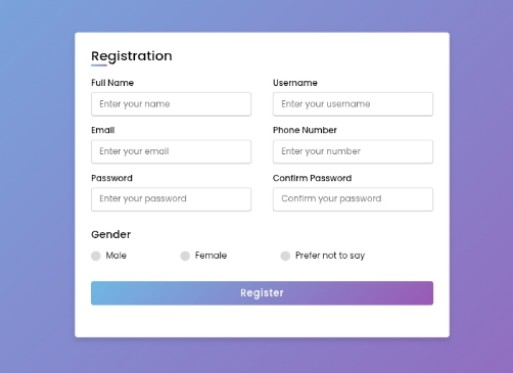

# Responsive Registration Form

A modern and **fully responsive registration form** built using **HTML** and **CSS**.  
This form adapts perfectly to different screen sizes including desktops, tablets, and mobile devices.

## Features

- **Responsive Design** – Works on all devices.
- **Clean Layout** – Simple and user-friendly form structure.
- **Modern Styling** – Attractive design using CSS only.
- **Cross-browser Compatible** – Tested on major browsers.

## Technologies Used

- **HTML5** – For structure and form elements.
- **CSS3** – For styling and responsive design.

## Screenshots

  

## Installation

1. Clone the repository:
   ```bash
   git clone https://github.com/your-username/responsive-registration-form.git
